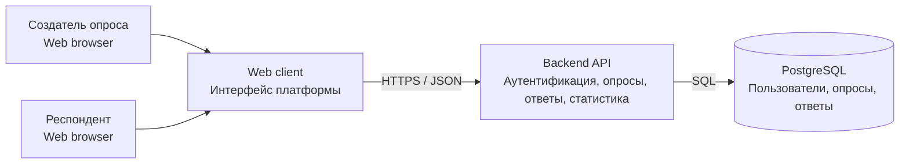
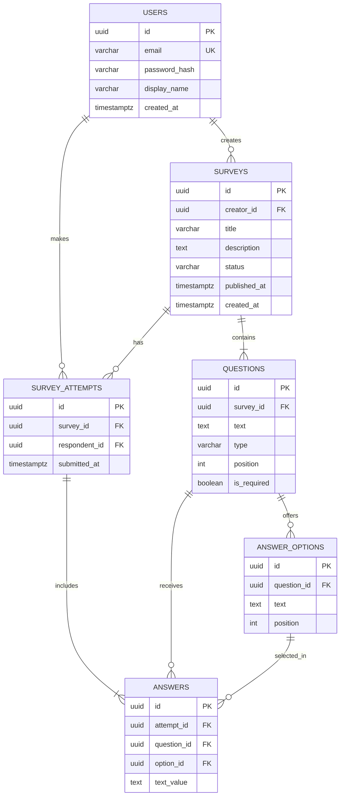

# Архитектура Survey Tool

## Описание проекта

Survey Tool - серверное приложение для создания и прохождения опросов.
Создатель опроса формирует вопросы, настраивает доступность и просматривает
результаты. Респондент отвечает на вопросы и может пройти каждый опрос только
один раз.

## Роли и Use Cases

### Создатель опроса

- Регистрируется и входит в систему.
- Создаёт, редактирует и удаляет черновики опросов.
- Добавляет вопросы и варианты ответов.
- Публикует и закрывает опрос.
- Просматривает агрегированные результаты.

### Респондент

- Регистрируется и входит в систему.
- Просматривает список доступных опросов.
- Открывает опрос и отправляет ответы.
- Просматривает подтверждение прохождения.

## Правила предметной области

- Опрос создаётся одним пользователем и состоит из одного или нескольких вопросов.
- Вопрос имеет тип: один вариант, несколько вариантов или текстовый ответ.
- Варианты задаются только для вопросов с выбором.
- Респондент может отправить только одно прохождение одного опроса.
- Ответ принадлежит одному прохождению и одному вопросу.

## C4 Container

Исходник диаграммы: [diagrams/c4-container.mmd](diagrams/c4-container.mmd).

## ERD базы данных

Исходник диаграммы: [diagrams/erd.mmd](diagrams/erd.mmd).

### Ограничения и индексы

- `users.email` - `UNIQUE NOT NULL`.
- `survey_attempts(survey_id, respondent_id)` - `UNIQUE`, запрещает повторное прохождение.
- `questions(survey_id, position)` и `answer_options(question_id, position)` - `UNIQUE`.
- Для внешних ключей создаются индексы: `surveys.creator_id`, `questions.survey_id`,
  `answer_options.question_id`, `survey_attempts.survey_id`,
  `survey_attempts.respondent_id`, `answers.attempt_id`, `answers.question_id`.
- `surveys.status` содержит только `draft`, `published` или `closed`.
- `questions.type` содержит только `single_choice`, `multiple_choice` или `text`.
- `answers.option_id` используется для выбора варианта, `answers.text_value` - для текстового ответа.

Схема находится в третьей нормальной форме: пользователи, опросы, вопросы,
варианты и ответы хранятся в отдельных таблицах, а неключевые поля зависят
только от ключей своих таблиц.
